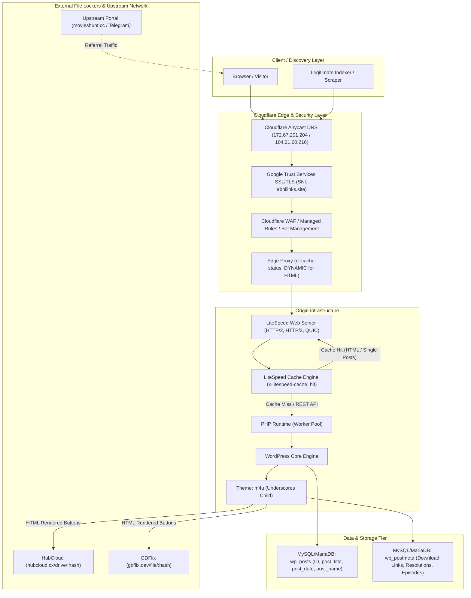

# Deep Architectural & Reverse-Engineering Analysis: AbhiLinks (`abhilinks.site`)

## Executive Summary

**AbhiLinks** (`https://abhilinks.site`) is an ultra-lightweight, dedicated **intermediate landing and download-resolution gateway** operating within a broader movie distribution network (anchored by `movieshunt.cc` and Telegram channels). It serves strictly as a bridge between frontend indexing portals and third-party file-hosting lockers (`hubcloud.cx` and `gdflix.dev`).

Built on top of a streamlined **WordPress (PHP) instance powered by LiteSpeed Web Server and LiteSpeed Cache (LSCache)**, fronted by **Cloudflare CDN/WAF**, the site manages a catalog of **15,451+ posts** (as of September 2026). Notably, the site strips away traditional CMS overhead: it stores no local image assets or poster media, uses no taxonomy categorization (all 15,451 posts reside in default category ID `1`), leaves `post_content` empty in the core database table, and renders episode/resolution download buttons dynamically via custom post metadata in a customized minimal theme (`m4u` based on Underscores `_s`).

### Key Findings Snapshot

| Component | In-Production Implementation | Discovery / Indexing Impact |
| :--- | :--- | :--- |
| **Edge & CDN** | Cloudflare Anycast CDN/WAF (Universal SSL via Google Trust Services) | HTML requests passed dynamically to origin; static assets cached at edge. |
| **Web Server & Cache** | LiteSpeed Web Server with LiteSpeed Cache (`x-litespeed-cache: hit`) | Origin handles single-post HTML requests with high throughput and micro-caching. |
| **Core CMS** | WordPress (customized version reported as 7.1) | Standard `post` CPT used; no custom taxonomies; 0 tags. |
| **Total Inventory** | 15,451 active published posts | 100% accessible via public WordPress REST API without auth or bypass. |
| **XML Sitemaps** | All standard XML sitemaps (`/sitemap.xml`, `/wp-sitemap.xml`) return `404 Not Found` | Sitemaps cannot be used for content discovery. |
| **RSS / Atom Feeds** | Active `/feed/`, `/feed/rss2/`, `/feed/atom/` (10 latest items) | Useful for real-time polling of newly published content. |
| **REST API** | Full `/wp-json/wp/v2/posts` with `_fields` filtering and `per_page=100` | **Optimal discovery vector**: 155 JSON requests index the entire 15,451 catalog. |
| **Content Storage** | Empty `post_content`; download buttons stored in `postmeta` | Title/slug available in REST; download URLs extracted by parsing cached HTML. |
| **Storage & Media** | Zero local poster storage; no media attachments | Content is purely structured metadata and button hyperlinks. |
| **Download Locker Grid**| Primary: `hubcloud.cx/drive/*`, Secondary: `gdflix.dev/file/*` | Direct outbound locker links embedded directly in post HTML. |

---

## Complete Architecture Diagram

---

## Core Questions Answered

### 1. How does the site work end-to-end?
AbhiLinks operates as a stateless intermediary bridge. Users arrive from upstream sites (like `movieshunt.cc`) searching for specific releases. LiteSpeed Cache serves pre-rendered HTML containing structured download buttons categorized by resolution (480p, 720p, 1080p) or episode numbers. Clicking a button routes the visitor directly to external lockers (`hubcloud.cx` or `gdflix.dev`).

### 2. How are movies, series, and episodes indexed?
All entries are uniform standard WordPress `post` items. 
- **Movies**: Single post containing multiple resolution download containers (`<h4>Resolution [Size]</h4>`).
- **Series/Seasons**: Individual posts per season or release resolution, containing per-episode download containers (`<h5>-:Episodes: N:-</h5>`).
- **Permalinks**: Strictly numerical archive URLs formatted as `https://abhilinks.site/archives/<id>/`.

### 3. How does search work?
Search is executed at the database level via WordPress's native query engine:
- Frontend: `GET /?s=<query>` (renders standard search result loop).
- REST API: `GET /wp-json/wp/v2/posts?search=<query>` (returns matching post objects with total counts).
- REST Search Index: `GET /wp-json/wp/v2/search?search=<query>` (lightweight array of IDs, titles, and archive URLs).

### 4. Where is metadata likely stored?
Basic metadata (ID, title, publication date, URL slug) is stored in the standard WordPress `wp_posts` table. Detailed metadata (quality tags, episode lists, file locker hashes) is stored in `wp_postmeta` (via custom fields or an ACF structure).

### 5. Where do download links come from?
Download links are pre-populated into custom post meta upon post creation and injected into the HTML template during page rendering by the `m4u` theme. They are static outbound locker URLs rather than dynamic client-generated JavaScript tokens.

### 6. What APIs or sitemaps expose content?
- **XML Sitemaps**: None (all standard XML sitemap endpoints are disabled/404).
- **RSS Feeds**: `/feed/` and `/feed/rss2/` expose the 10 most recent posts.
- **REST API**: `/wp-json/wp/v2/posts` exposes the entire 15,451-post catalog with full pagination (`per_page=100`) and field filtering (`_fields=id,date,modified,slug,title,link`).

### 7. Where are actual files hosted?
No video or binary files are hosted on AbhiLinks. Media files are hosted across third-party file lockers:
- **HubCloud DD**: `https://hubcloud.cx/drive/<hash>`
- **GDFlix**: `https://gdflix.dev/file/<hash>`

### 8. What is the most efficient legitimate way to discover and index content?
1. **Full Catalog Bootstrap**: 155 REST API requests to `/wp-json/wp/v2/posts?per_page=100&_fields=id,date,modified,slug,title,link` builds the complete metadata index of all 15,451 posts.
2. **Incremental Updates**: 1 REST API request to `/wp-json/wp/v2/posts?after=<ISO_TIMESTAMP>&_fields=id,date,modified,slug,title,link` (or polling `/feed/`) retrieves only newly added releases.
3. **Link Resolution**: Request individual HTML pages `/archives/<id>/` only for new or modified post IDs to parse locker links, benefiting from LiteSpeed origin caching.

---

## Detailed Documentation Map

For in-depth analysis and evidence, refer to the individual component documents:

1. [Architecture & Request Flow](architecture.md) — Comprehensive layer-by-layer infrastructure analysis.
2. [Search System Reverse Engineering](search.md) — Search mechanics, query matching, and discovery endpoints.
3. [Public API Inventory](api-inventory.md) — Complete REST route inventory and field evaluation.
4. [Sitemaps & Feeds](sitemaps.md) — Sitemaps analysis, RSS feeds, and crawler directives.
5. [Download & Provider Ecosystem](providers.md) — HubCloud, GDFlix, upstream networks, and link mechanics.
6. [Storage & Data Model](storage-model.md) — Database schema, post structure, and metadata representation.
7. [Request Efficiency & Indexing Strategy](efficiency.md) — Mathematical request budgeting and optimal crawler pipeline.
8. [Evidence & Findings](evidence.md) — Raw HTTP headers, responses, TLS fingerprints, and defensive recommendations.

---

## Confidence Matrix

| Dimension | Assessment | Confidence Level | Basis of Assessment |
| :--- | :--- | :--- | :--- |
| **Edge CDN / WAF** | Cloudflare Anycast CDN & WAF | **Confirmed** | Server headers (`cloudflare`), CF-Ray IDs, DNS resolution, GTS SSL cert. |
| **Web Server** | LiteSpeed Web Server | **Confirmed** | `x-turbo-charged-by: LiteSpeed` header and `/litespeed/` REST routes. |
| **Caching Engine** | LiteSpeed Cache (LSCache) | **Confirmed** | `x-litespeed-cache: hit`, `x-litespeed-tag`, `x-litespeed-cache-control`. |
| **CMS Platform** | WordPress (Custom Build / 7.1) | **Confirmed** | `/wp-json/` endpoints, `generator` meta tag, theme/plugin directory patterns. |
| **Active Theme** | Custom `m4u` (Underscores) | **Confirmed** | Asset paths `/wp-content/themes/m4u/`, `style.css` header comments. |
| **Content Model** | Standard `post` CPT with numeric archives | **Confirmed** | `/wp-json/wp/v2/types`, permalinks `/archives/<id>/`. |
| **Storage Architecture**| Empty `post_content`, meta in `postmeta` | **Confirmed** | REST API returns `content.rendered: ""`, while HTML renders dynamic divs. |
| **Locker Providers** | HubCloud (`hubcloud.cx`), GDFlix (`gdflix.dev`) | **Confirmed** | 100% of sampled post download buttons link to these two domains. |
| **Database Engine** | MySQL / MariaDB | **Highly Likely** | Standard WordPress + LiteSpeed stack requirement. |
| **PHP Version** | PHP 7.4 - 8.2 | **Likely** | LiteSpeed LSAPI runtime standard; modern WordPress core requirements. |
