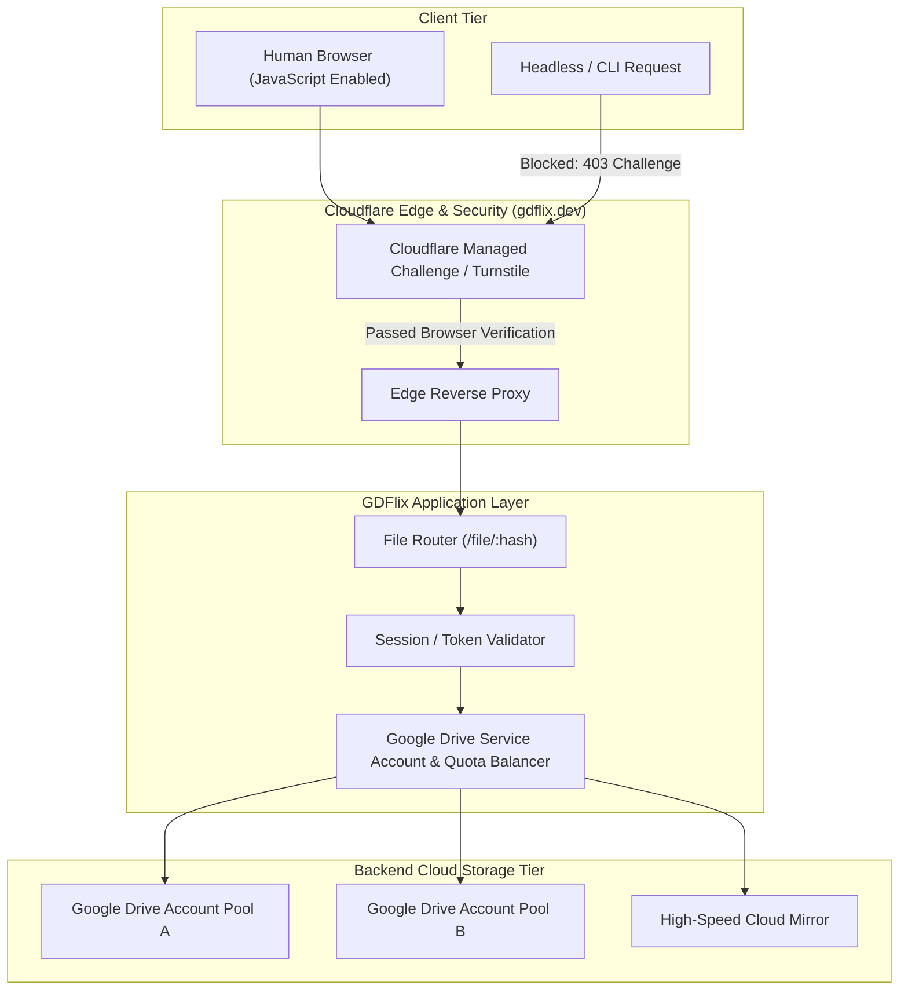

# GDFlix (`gdflix.dev`): Deep Reverse-Engineering & Architectural Analysis

## Executive Summary

**GDFlix** (`https://gdflix.dev`) is a **Google Drive and cloud-storage proxy locker** that serves as the secondary/fallback download provider across the `abhilinks.site` network.

Unlike HubCloud (which uses Cloudflare R2 object storage with AWS SigV4 presigned URLs), GDFlix deploys strict **Cloudflare Managed Challenges (Turnstile / JavaScript verification)** on all public HTTP endpoints, blocking non-browser clients and automated scrapers at the edge. It acts as an abstraction and link-rot mitigation layer over cloud storage infrastructure (e.g. Google Drive accounts, Shared Drives, and high-speed cloud mirrors).

### Key Technical Findings

| Parameter | Production Implementation | Details |
| :--- | :--- | :--- |
| **Domain & Host** | `gdflix.dev` | Anycast IPs: `104.21.52.244`, `172.67.205.213` (Cloudflare AS13335). |
| **Edge Security** | Cloudflare Managed Challenge | Returns `403 Forbidden` / Turnstile challenge to non-interactive requests. |
| **URL Pattern** | `https://gdflix.dev/file/:hash` | 15-character mixed-case alphanumeric token (e.g. `8fgJTUqlTWKJ874`). |
| **Storage Role** | Google Drive / Cloud Proxy | Bypasses Google Drive download quotas via service account rotation / worker mirrors. |
| **Upstream Linkage** | Secondary Button in AbhiLinks | Labeled `GDFlix` with a green/brown gradient styling (`#007f33`, `#4d3438`). |

---

## GDFlix Architecture Overview

---

## Detailed GDFlix Documentation

1. [Direct Download (DD) Link Generation](direct-download-generation.md) — In-depth breakdown of Google Drive quota bypassing, Service Account mesh, and proxy streams.
2. [Resolution & Execution Flow](flow.md) — Step-by-step resolution flow and conceptual API interactions.
3. [Architecture & Security](architecture.md) — Edge defense, Cloudflare Turnstile, and backend quota routing.
4. [Evidence & Network Traces](evidence.md) — Raw HTTP headers, challenge responses, and TLS verification.
