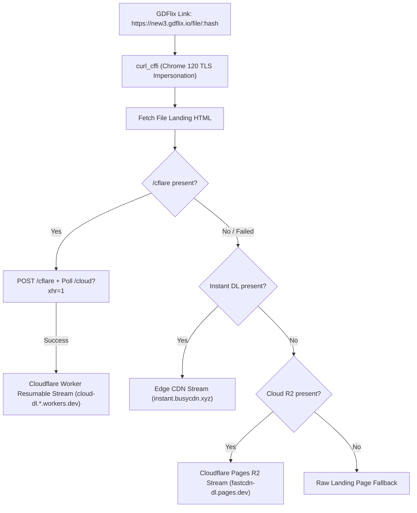

# GDFlix Resolution & Execution Flow

## 1. End-to-End Execution Flow (BhilaiTV Engine)

```text
Step 1: Inbound Request from User / UI
Click [ SERVER 2 ] in BhilaiTV UI
   │
   ▼
Step 2: Backend curl_cffi Worker Session Initialization
FastAPI dispatches background thread with `curl_cffi.requests.Session(impersonate="chrome120")`
   │
   ▼
Step 3: Cloudflare JA3 Handshake Pass
BoringSSL TLS fingerprint matches Chrome 120 -> Cloudflare WAF passes request without challenge
GET https://new3.gdflix.io/file/:hash -> Status: 200 OK
   │
   ▼
Step 4: FastCloud / ZipDisk Task Dispatch
1. GET /cflare/:timestamp/:hash -> extracts session `key`
2. POST /cflare/:timestamp/:hash with (action="cloud", key=key) -> gets /cloud/:id/:hash?token=...
3. GET /cloud/...?token=...&xhr=1 -> polls task completion -> gets redirect: /cloud/:id2/:hash
4. GET /cloud/:id2/:hash -> extracts https://cloud-dl.*.workers.dev/... URL
   │
   ▼
Step 5: Direct URL Delivery
FastAPI returns JSON: {"direct_url": "https://cloud-dl.*.workers.dev/..."}
BhilaiTV UI transforms button to [ ⬇ SERVER 2 — DOWNLOAD ]
User clicks -> Direct resumable high-speed stream begins with 0 ads, 0 trackers, 0 viruses.
```

---

## 2. Resolver Fallback Hierarchy


