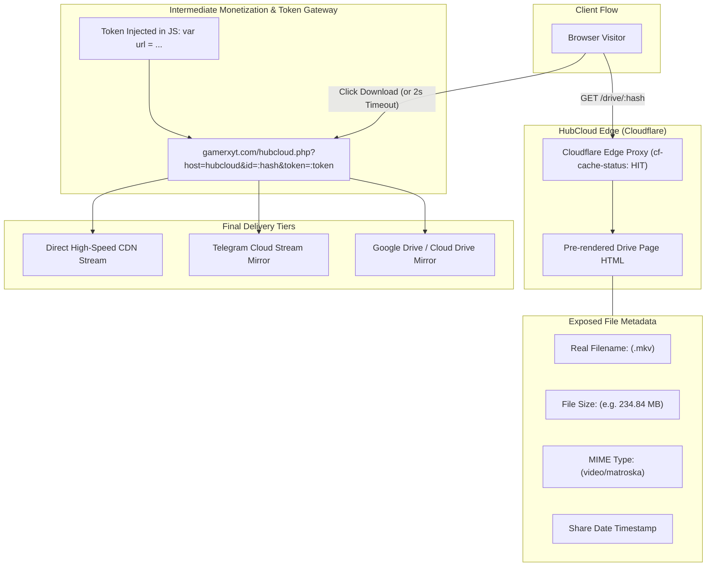

# HubCloud (`hubcloud.cx`): Deep Reverse-Engineering & Architectural Analysis

## Executive Summary

**HubCloud** (`https://hubcloud.cx`) is a specialized **intermediate file-locker and direct-download (DD) gateway** heavily utilized by streaming and movie syndication networks (including `abhilinks.site`, `movieshunt.cc`, and `imovies4u.me`). 

HubCloud does not serve binary files directly on its root or drive pages. Instead, it serves as a **file metadata descriptor, monetization layer, and session-token generation gateway** that resolves into intermediate redirectors (e.g., `gamerxyt.com`) before reaching final CDN file storage or Telegram mirror streams.

### Key Technical Findings

| Parameter | Production Implementation | Details |
| :--- | :--- | :--- |
| **Domain & Host** | `hubcloud.cx` | Anycast IPs: `172.67.199.249`, `104.21.44.126` (Cloudflare AS13335). |
| **Edge Cache** | Cloudflare Edge Cache | `cf-cache-status: HIT` on drive pages; cached directly at edge. |
| **URL Pattern** | `https://hubcloud.cx/drive/:hash` | 15-character alphanumeric persistent file identifier. |
| **Exposed Metadata** | Rich File Attributes | Exact release filename (`.mkv`), precise file size (MB/GB), MIME type (`video/matroska`), share timestamp. |
| **Next-Hop Redirect** | `gamerxyt.com/hubcloud.php` | Dynamic URL containing `host=hubcloud`, `id=:hash`, and Base64 HMAC `token`. |
| **Monetization** | Adcash / Popunder Network | Ad scripts loaded from CloudFront CDN (`d33f51dyacx7bd.cloudfront.net`). |
| **Network Affiliates** | Multi-Domain Mesh | `abhilinks.life`, `new.m4ulinks.com`, `m4ulinks.com`, `imovies4u.me`, `movies4u.review`. |

---

## Architecture & Request Flow

---

## Detailed HubCloud Documentation

1. [Architecture & Infrastructure](architecture.md) — Detailed edge, backend, and security topology.
2. [Flow & Link Resolution Mechanics](flow.md) — End-to-end trace from drive landing to final delivery.
3. [Evidence & Network Traces](evidence.md) — Raw HTTP traces, HTML snippets, and JavaScript logic.
